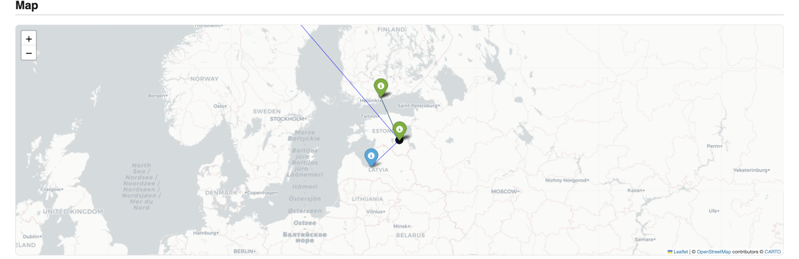
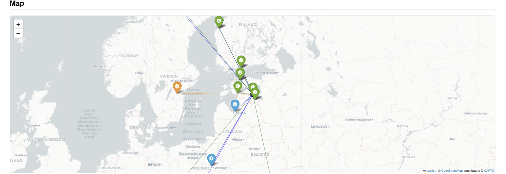

# Tartu Arrivals

Flight activity at Tartu Airport (ICAO `EETU`), Estonia, pulled from
[FlightAware's AeroAPI](https://www.flightaware.com/commercial/aeroapi/).
Started as a Jupyter notebook proof of concept; now also two standalone
scripts that generate self-contained HTML reports with an interactive map.

> **Requires a FlightAware AeroAPI account and API key.** This project is
> a client for FlightAware's commercial AeroAPI — it does not ship any
> flight data itself. Nothing here will run without:
> 1. Registering for an account at [flightaware.com/commercial/aeroapi](https://www.flightaware.com/commercial/aeroapi/)
> 2. Generating an API key from your AeroAPI dashboard
> 3. Putting that key in a local `.env` file (see [Setup](#setup) below)
>
> AeroAPI is a paid, metered API (FlightAware may offer a free/trial quota
> — check current terms on their site) with a limited request quota; see
> [How it avoids hammering the API](#how-it-avoids-hammering-the-api).

## What's here

- **`generate_report.py`** — a 24h-window report: actual arrivals/departures
  for the past 24 hours, scheduled arrivals/departures for the next 24 hours.
- **`generate_history_report.py`** — a longer-lookback report: actual
  arrivals/departures over the last ~10 days (the maximum AeroAPI's
  live-tracked endpoints retain), with aircraft type and tail number per
  flight.
- Both reports embed a [Folium](https://python-visualization.github.io/folium/)
  map of origin/destination airports, and highlight routes to/from Sweden.
- `notebooks/tartu_arrivals.ipynb` — the original notebook, useful for
  ad hoc exploration of a specific time window.

## Sample output

*(snapshot from the last run — regenerate with the scripts below for
current data)*

### Map

24-hour report:



10-day history report — orange marker/line is the Sweden-highlighted route:



### Actual arrivals

| Date | Time (local) | Flight | Reg. | Aircraft | Origin | Status | vs. schedule |
|---|---|---|---|---|---|---|---|
| Thu 06 Aug | 20:32 | LN-IFI | — | — | Tartu (EETU) | Arrived | on time |
| Thu 06 Aug | 19:41 | OY-BKM | — | — | Spilve (EVRS) | Arrived | -9 min |
| Thu 06 Aug | 16:06 | ES-SKI | — | PC12 | In flight near 65.73, 13.08 | Arrived | on time |
| Thu 06 Aug | 15:20 | FIN1047 | OH-ATJ | AT72 | Vantaa (EFHK) | Arrived / Delayed | +45 min |
| Wed 05 Aug | 21:15 | LN-IFI | — | — | Tartu (EETU) | Arrived | on time |
| Wed 05 Aug | 20:33 | LN-IFI | — | — | Tartu (EETU) | Arrived | on time |
| Wed 05 Aug | 14:42 | SCR168 | D-CWAG | C56X | Nowy Dwor Mazowiecki (EPMO) | Arrived | -6 min |
| Wed 05 Aug | 14:40 | FIN1047 | OH-ATI | AT72 | Vantaa (EFHK) | Arrived / Gate Arrival | on time |
| ... | *21 more rows in the full report* | | | | | | |

### Actual departures

| Date | Time (local) | Flight | Reg. | Aircraft | Destination | Status | vs. schedule |
|---|---|---|---|---|---|---|---|
| Thu 06 Aug | 20:01 | LN-IFI | — | — | Tartu (EETU) | Arrived | on time |
| Thu 06 Aug | 15:44 | FIN1048 | OH-ATJ | AT72 | Vantaa (EFHK) | Arrived / Gate Arrival | +44 min |
| Wed 05 Aug | 20:59 | LN-IFI | — | — | Tartu (EETU) | Arrived | on time |
| Wed 05 Aug | 20:05 | LN-IFI | — | — | Tartu (EETU) | Arrived | on time |
| Wed 05 Aug | 16:04 | AZE599 | D-AMME | E145 | Tallinn (EETN) | Arrived | on time |
| Wed 05 Aug | 14:59 | FIN1048 | OH-ATI | AT72 | Vantaa (EFHK) | Arrived / Gate Arrival | on time |
| Tue 04 Aug | 15:10 | FIN1048 | OH-ATP | AT72 | Vantaa (EFHK) | Arrived / Gate Arrival | +10 min |
| Tue 04 Aug | 14:19 | LN-IFI | — | — | Tartu (EETU) | Arrived | +15 min |
| ... | *20 more rows in the full report* | | | | | | |

The full reports (all rows, plus scheduled-flight tables and the live,
zoomable, clickable map) are generated as self-contained HTML files by the
scripts below — open them in a browser.

## Setup

1. Sign up and generate a key at [flightaware.com/commercial/aeroapi](https://www.flightaware.com/commercial/aeroapi/)
   if you haven't already (see the callout above).
2. Install and configure:

```bash
python3 -m venv .venv
source .venv/bin/activate
pip install -r requirements.txt
python -m ipykernel install --user --name arrivals_to_tartu --display-name "arrivals_to_tartu"
cp .env.example .env  # then edit .env and paste in your AeroAPI key
```

`.env` holds `FLIGHTAWARE_API_KEY=<your key>` and is git-ignored — it is
never committed, and every script/notebook here reads the key only from
this local file (via `src/flightaware_client.py`).

## Usage

```bash
source .venv/bin/activate
python generate_report.py           # -> output/EETU_report.html
python generate_history_report.py   # -> output/EETU_history_report.html
```

Each overwrites the same file on every run (not timestamped), so `output/`
never accumulates stale copies. Open the resulting HTML file directly in a
browser.

Or explore interactively:

```bash
jupyter notebook notebooks/tartu_arrivals.ipynb
```
(select the `arrivals_to_tartu` kernel)

## How it avoids hammering the API

FlightAware's AeroAPI has a fairly tight request quota, and the two report
scripts' windows overlap (24h vs ~10 days). Rather than each script calling
the API fresh every run:

- **`src/store.py`** keeps a local Parquet cache (`output/flights.parquet`)
  of every flight record either script has ever fetched, plus a small JSON
  file tracking exactly which time range has already been synced per
  endpoint. A rerun only asks AeroAPI for the slice of the window that
  isn't already covered — often zero new records.
- **`src/mapping.py`** caches airport coordinates (`output/airport_coords_cache.json`)
  forever, since they never change.

Both caches are shared between the two report scripts (and the notebook can
use the same client), so running one warms the cache for the other.

## Project layout

```
generate_report.py            24h-window HTML report
generate_history_report.py    ~10-day HTML report with aircraft/tail info
notebooks/tartu_arrivals.ipynb  original exploratory notebook
src/
  flightaware_client.py       thin AeroAPI wrapper (auth, endpoints, pagination)
  arrivals.py                 raw API response -> pandas DataFrame
  store.py                    local Parquet cache + incremental sync
  mapping.py                  airport coordinate cache + Folium map builder
output/                       generated reports & caches (git-ignored)
docs/images/                  screenshots used in this README
```

See `.claude/skills/tartu-arrivals/SKILL.md` for a deeper dive into API
constraints, known gotchas, and conventions used across this project.

## Known limitations

- AeroAPI's live-tracked (`flights/arrivals`, `flights/departures`)
  endpoints only retain 10 days of history — `generate_history_report.py`
  clamps to that regardless of what's requested, and says so in the report.
  The local cache does let the *effective* archive grow past 10 days over
  time, as long as the scripts are run at least that often.
- Scheduled-flight data (`scheduled_arrivals`/`scheduled_departures`) is
  mutable (delays, reschedules); once a slot has been cached, the sync
  logic extends into new future territory but does not re-poll already-seen
  flights for changes.
- This is a personal proof of concept, not a production service — no
  automated scheduling is set up (see "Known future directions" in the
  skill file).

## License

No license specified — personal project, all rights reserved by default.
